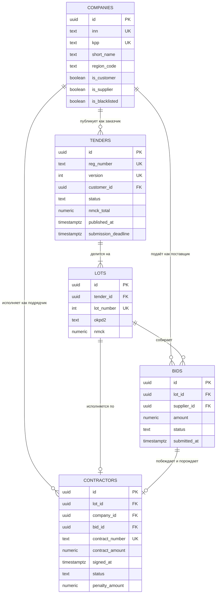

# Задание 4 — Схема БД «Тендерная площадка»

Проектирование схемы PostgreSQL для системы мониторинга госзакупок:
таблицы компаний, тендеров, лотов, ставок и исполнителей, внешние ключи,
индексы и аналитические запросы.

Решение развивает модель данных проекта [Тендер-радар](../../README.md)
(см. [`supabase/migrations/0001_init.sql`](../../supabase/migrations/0001_init.sql)):
там закупка — плоская запись извещения из ЕИС, здесь она разворачивается
в полноценную площадку с торгами и исполнением контрактов.

---

## Содержание

| Файл | Что внутри |
|---|---|
| [`01_schema.sql`](01_schema.sql) | DDL: 5 таблиц, 9 FK, 36 индексов, CHECK-констрейнты, триггеры |
| [`02_seed.sql`](02_seed.sql) | Генератор тестовых данных (~450 тыс. строк) |
| [`03_analytics.sql`](03_analytics.sql) | 3 аналитических запроса |
| [`04_explain.sql`](04_explain.sql) | Снятие планов выполнения (EXPLAIN ANALYZE) |
| [`docker-compose.yml`](docker-compose.yml) | Postgres 16 для локального прогона |

---

## 1. Модель данных



Поток данных: заказчик публикует **тендер** → тендер делится на **лоты** →
поставщики подают **ставки** на конкретный лот → победившая ставка порождает
запись об **исполнителе** (контракт).

---

## 2. Ключевые решения и альтернативы

### 2.1. Одна таблица `companies`, а не `customers` + `suppliers`

Заказчик и поставщик — это одна сущность «организация», отличается только
роль в конкретной закупке. Одна и та же компания бывает заказчиком в своей
закупке и участником в чужой; ГБУ регулярно выступает в обеих ролях.

Разделение на две таблицы дало бы дублирование реквизитов (ИНН, КПП, ОГРН,
адрес), рассинхрон при обновлении данных из ЕГРЮЛ и необходимость
`UNION` в половине аналитических запросов. Роль выражена флагами
`is_customer` / `is_supplier`: ролей ровно две и новых не предвидится, так
что отдельная таблица ролей была бы усложнением без выигрыша.

### 2.2. `lots` вынесены из `tenders`

Одна закупка может содержать несколько лотов, и торги по каждому идут
независимо: у каждого лота свой победитель, своя цена, свой контракт.
Именно лот, а не тендер, — предмет ставки. Хранить лот полями в `tenders`
означало бы либо ограничение «один лот на закупку», либо массивы/JSON, по
которым не построить нормальные внешние ключи и агрегаты.

### 2.3. `contractors` — роль, а не отдельное юрлицо

«Исполнитель» — это компания из `companies`, выигравшая конкретный лот.
Реквизиты у неё уже есть, поэтому таблица хранит не их, а **факт и
параметры исполнения**: номер контракта, сумму, даты подписания и
завершения, статус, начисленные штрафы.

Альтернатива — назвать таблицу `contracts` — точнее по смыслу, но задание
задаёт состав таблиц явно, поэтому имя сохранено, а назначение
зафиксировано в `COMMENT ON TABLE`.

### 2.4. Статусы тендера совпадают с заданием 6

`tenders.status ∈ (draft, active, won, lost)` — это взгляд участника
площадки, и он же нужен сервису трекинга из
[задания 6](../task-06-tender-status-api/SOLUTION.md), который работает
поверх этой схемы. Держать два разных набора статусов на одну сущность —
прямой путь к рассинхрону, поэтому набор один.

---

## 3. Инварианты: что закрыто на уровне БД

Правило простое: инвариант, нарушение которого делает данные бессмысленными,
закрывается СУБД, а не проверкой в коде. Код можно обойти вторым сервисом,
скриптом миграции или гонкой транзакций — базу обойти нельзя.

| Инвариант | Как закрыт |
|---|---|
| На лоте не может быть двух победителей | Частичный уникальный индекс `bids_single_winner_per_lot on bids (lot_id) where status = 'won'` |
| Контракт не может ссылаться на ставку с чужого лота | Составной FK `contractors (bid_id, lot_id) → bids (id, lot_id)` |
| Контракт не может быть записан на компанию, которая эту ставку не подавала | Составной FK `contractors (bid_id, company_id) → bids (id, supplier_id)` |
| Одна компания — одна ставка на лот | `unique (lot_id, supplier_id)` |
| Один контракт на лот и одна ставка — в один контракт | `unique (lot_id)`, `unique (bid_id)` |
| Опубликованная закупка обязана иметь дату публикации и дедлайн | CHECK `tenders_published_fields` |
| Приём заявок не закрывается раньше публикации | CHECK `tenders_deadline_after_publish` |
| Завершённый контракт имеет дату завершения, незавершённый — не имеет | CHECK `contractors_completed_consistent` |
| ИНН/КПП/ОГРН/ОКПД2 — корректного формата | CHECK по регулярным выражениям |
| Суммы положительны, штрафы неотрицательны | CHECK на `nmck`, `amount`, `contract_amount`, `penalty_amount` |

**Про составные FK отдельно.** `contractors` ссылается на лот, компанию и
ставку тремя ключами. Каждый по отдельности валиден — и при этом запись
может описывать несуществующую ситуацию: контракт по лоту A, основанный на
ставке к лоту B, подписанный компанией C, которая ту ставку не подавала.
Три одиночных FK такое пропустят. Составные — нет, и цена этому всего два
дополнительных UNIQUE на `bids`.

Это же снимает вопрос к `contractors.company_id`: поле дублирует
`bids.supplier_id` ради аналитики без лишнего join, и обычно денормализация
означает риск расхождения — здесь расхождение физически невозможно.

---

## 4. Индексная стратегия

36 индексов — это не «на всякий случай», каждый закрывает конкретный доступ.

**Под внешние ключи.** PostgreSQL не создаёт индекс на дочерней стороне FK
автоматически. Без него `delete from tenders` даёт seq scan по `lots` на
каждую удаляемую строку, а `ON DELETE CASCADE` превращает удаление одной
закупки в полный проход по таблице ставок.

**Частичные — под горячие подмножества.**
`tenders_active_deadline_idx ... where status = 'active'` обслуживает самый
частый запрос площадки («открытые закупки, у которых скоро дедлайн»), но
занимает место только под активную часть таблицы — единицы процентов от
исторического архива. То же для `contractors_active_deadline_idx` и
`companies_supplier_region_idx`.

**Покрывающие (`INCLUDE`) — под аналитику.**
`contractors_signed_at_idx (signed_at desc) include (company_id, contract_amount)`
позволяет собрать топ поставщиков за период, не заглядывая в heap.
Аналогично `bids_lot_amount_idx (lot_id, amount) include (supplier_id)` для
поиска лучшей ставки по лоту.

**Составной — по правилу «равенство до диапазона».**
В `tenders_region_published_idx (region_code, published_at desc)` порядок
колонок не произволен: `region_code` участвует в условии равенства,
`published_at` — в диапазонном. Обратный порядок сделал бы индекс
непригодным для отбора по региону.

**Специальные классы операторов.**
`lots_okpd2_prefix_idx (okpd2 text_pattern_ops)` — чтобы префиксный поиск
`LIKE '81.2%'`, на котором построена фильтрация радаров, шёл по индексу
независимо от локали БД. `lots_title_trgm_idx using gin (title gin_trgm_ops)` —
под поиск по подстроке в названии лота.

**Уникальные частичные вместо составного UNIQUE.**
У головной организации и филиала ИНН общий, КПП разный; у ИП КПП нет вовсе.
Один `unique (inn, kpp)` не спас бы: NULL в UNIQUE не сравниваются между
собой, и дубли ИП прошли бы незамеченными. Отсюда два частичных индекса —
`where kpp is not null` и `where kpp is null`.

---

## 5. Тестовые данные

Генератор создаёт ~450 тыс. строк за 18 месяцев:

| Таблица | Строк |
|---|---|
| `companies` | 5 000 |
| `tenders` | 50 000 |
| `lots` | 100 063 |
| `bids` | 322 043 |
| `contractors` | 20 745 |

Распределения намеренно неравномерные. На равномерных данных планировщик
строит планы по усреднённой модели, и замеры на такой базе ничего не
говорят о поведении на проде:

- Москва и МО дают ~40% закупок — перекос по регионам, как в ЕИС;
- длинный хвост поставщиков: медиана — единицы ставок, лидер — свыше 10 000;
- лог-нормальные цены лотов: много мелких закупок, единицы крупных;
- 11 862 лота без ставок — несостоявшиеся закупки, случай нулевого
  знаменателя в аналитике.

**Про воспроизводимость.** Выбор строк справочника сделан хешем от ключа
строки-источника, а не `random()`. Причина не стилистическая:
некоррелированный `random()` внутри `LATERAL` планировщик вправе вычислить
один раз на весь запрос. Первая версия генератора из-за этого вставила ноль
строк, а при другом плане раздала бы всем 50 000 закупок один и тот же
статус. Первичные ключи по той же причине выводятся из ключа строки, а не
из `gen_random_uuid()`: от `id` зависят все хеш-выборки ниже по скрипту, и
со случайными идентификаторами набор данных менялся бы от прогона к
прогону — сравнивать планы «до/после» на такой базе нельзя.

Проверено: два последовательных прогона дают идентичные объёмы.
Единственный недетерминированный вход — `now()`, от него зависит только
сдвиг всего окна дат.

---

## 6. Аналитические запросы

### Запрос 1 — топ-3 компании по сумме выигранных тендеров за месяц

Помимо суммы возвращает число контрактов, среднюю глубину снижения от НМЦК
(видно, ценой какой маржи взяты победы) и долю компании в общем объёме
периода.

```
 rank |    short_name     |    inn     | region | contracts | total_amount | share_% | discount_%
------+-------------------+------------+--------+-----------+--------------+---------+-----------
    1 | АО «Компания-1»   | 1000000001 | 77     |        23 |  13655391.26 |    2.38 |     28.25
    2 | АО «Компания-230» | 1000000230 | 61     |         2 |   6403572.58 |    1.11 |     20.88
    3 | АО «Компания-23»  | 1000000023 | 77     |         6 |   5928911.53 |    1.03 |     21.63
```

Что в нём неочевидного:

- **Расторгнутые контракты исключены.** Подписанный и затем расторгнутый
  контракт выигрышем не является; без этого фильтра рейтинг завышает
  результаты компаний, срывающих исполнение.
- **`rank()`, а не `row_number()`.** При равных суммах обе компании должны
  получить одно место. С `row_number()` порядок определялся бы физическим
  порядком чтения строк, то есть менялся бы от плана к плану.
- **`sum() over ()` считается до `LIMIT`.** Доля рынка берётся от всего
  периода, а не от трёх выведенных строк. Это неочевидный, но важный
  порядок вычислений: оконные функции применяются после `GROUP BY`, но
  до `LIMIT`.
- **`nullif(nmck, 0)`** страхует деление на ноль, хотя CHECK и не должен
  пропускать нулевую НМЦК.

### Запрос 2 — эффективность участия поставщиков по категориям ОКПД2

По каждому классу ОКПД2 — тройка сильнейших за полгода: подано ставок,
выиграно, win-rate, позиция относительно конкурентов в том же классе.

Это тот срез, ради которого площадка и нужна поставщику: «в какой нише я
реально конкурентоспособен, а где просто трачу время на заявки».

```
 okpd | rank |    short_name     | bids_total | bids_won | win_rate_% | percentile | competitors
------+------+-------------------+------------+----------+------------+------------+------------
 81   |    1 | АО «Компания-1»   |       1192 |      103 |       8.64 |       58.1 |        2627
 81   |    2 | АО «Компания-2»   |        386 |       33 |       8.55 |       58.1 |        2627
 81   |    3 | ООО «Поставщик-3» |        303 |       22 |       7.26 |       55.0 |        2627
```

Конкретные числа зависят от момента генерации: запрос смотрит на окно
«последние полгода», а окно дат в сгенерированных данных отсчитывается от
`now()`. Состав и порядок лидеров при этом устойчивы.

Что в нём неочевидного:

- **`count(*) filter (where ...)`** вместо `sum(case when ... then 1 end)`:
  читается прямо и не считает NULL как ноль по недосмотру.
- **`HAVING count(*) >= 5`** отсекает случайных участников. Без него весь
  топ занимают компании с win-rate 100% при одной поданной заявке — это
  статистический шум, а не результат.
- **`percent_rank()`** даёт позицию в распределении, устойчивую к разному
  числу участников: сравнивать «3-е место из 5» и «3-е из 2677» по
  абсолютному рангу бессмысленно.
- **Ставки со статусом `submitted` исключены** — торги ещё идут, исход
  неизвестен, и включать их в знаменатель win-rate некорректно.

### Запрос 3 (дополнительный) — помесячная динамика

Объём и число контрактов по месяцам, прирост к предыдущему месяцу через
`LAG` и скользящее среднее за 3 месяца через рамку окна. Самосоединение
таблицы по месяцам дало бы тот же результат дороже и хуже читаемо.

---

## 7. Планы выполнения

Замеры: PostgreSQL 16.13, конфигурация по умолчанию, прогретый кеш,
воспроизводятся через [`04_explain.sql`](04_explain.sql).

### Найденная проблема: граница периода в отдельном CTE

Первая версия запроса 1 выносила границу периода в CTE:

```sql
with period as (select now() - interval '30 days' as from_ts), ...
where c.signed_at >= (select from_ts from period)
```

Выглядит аккуратнее — читателю сразу видно окно расчёта. Планировщику,
однако, значение приходит через InitPlan и на этапе планирования
неизвестно, поэтому селективность оценивается по умолчанию, а индекс не
используется:

```
->  Hash Join (actual rows=801)
      ->  Index Only Scan using lots_pkey on lots  (actual rows=100063)   ← все лоты
      ->  Hash (actual rows=801)
            ->  Seq Scan on contractors c  (actual rows=801)
                  Filter: ((signed_at >= $0) AND (status <> 'terminated'))
                  Rows Removed by Filter: 19944                           ← вся таблица
Planning Time: 1.567 ms
Execution Time: 17.618 ms
```

С предикатом на месте планировщик знает границу и меняет форму плана:

```
->  Nested Loop (actual rows=801)
      ->  Bitmap Heap Scan on contractors c (actual rows=801)
            Recheck Cond: (signed_at >= (now() - '30 days'::interval))
            ->  Bitmap Index Scan on contractors_signed_at_idx (actual rows=842)
      ->  Index Only Scan using lots_pkey on lots l (actual rows=1 loops=801)  ← только нужные
Planning Time: 0.354 ms
Execution Time: 3.912 ms
```

**17.6 мс → 3.9 мс, в 4.5 раза.** Существеннее самого времени то, что
изменилась форма плана: вместо чтения всей таблицы контрактов и всех лотов
запрос читает 801 строку по индексу. На текущих 20 тыс. контрактов разница
измеряется миллисекундами, на реальном объёме — порядками.

### Запрос 2

```
Execution Time: 104.292 ms
```


Здесь seq scan по `bids` — правильный выбор: запрос агрегирует ставки за
полгода, это большая часть таблицы, и точечный доступ по индексу был бы
дороже. Планировщик распараллелил его на 2 воркера. Отдельно стоит
отметить `Run Condition: (rank() OVER (?) <= 3)` — PostgreSQL 15+ умеет
проталкивать условие на ранг внутрь оконной функции и обрывать вычисление,
не ранжируя все 5 207 групп до конца.

---

## 8. Как запустить

```bash
cd tasks/task-04-db-schema
docker compose up -d

docker compose exec -T db psql -U tender -d tender_platform -v ON_ERROR_STOP=1 < 01_schema.sql
docker compose exec -T db psql -U tender -d tender_platform -v ON_ERROR_STOP=1 < 02_seed.sql   # ~80 с
docker compose exec -T db psql -U tender -d tender_platform < 03_analytics.sql
docker compose exec -T db psql -U tender -d tender_platform < 04_explain.sql
```

Скрипты идемпотентны: `01_schema.sql` пересоздаёт схему целиком,
`02_seed.sql` начинается с `TRUNCATE`.

---

## 9. Что осознанно не сделано

- **Партиционирование `bids` и `tenders` по дате.** На реальном объёме
  (десятки миллионов ставок) это следующий шаг, но на 322 тыс. строк
  партиционирование только усложнило бы схему и планы. Решение принимается
  по факту роста, а не заранее.
- **RLS.** В основном проекте политики есть
  ([`0001_init.sql`](../../supabase/migrations/0001_init.sql)), потому что
  фронт ходит в базу напрямую под пользовательским JWT. Здесь доступ идёт
  через API-слой ([задание 6](../task-06-tender-status-api/SOLUTION.md)),
  и разграничение — его ответственность.
- **История изменений статусов.** Требуется заданием 6 и добавляется его
  собственной миграцией, чтобы схема площадки и аудит статусов
  версионировались независимо.
- **Материализованные представления под аналитику.** Оправданы, когда
  запросы станут дороже допустимого; сейчас 4 мс и 104 мс укладываются
  с запасом, а MV принесли бы вопрос актуальности данных.
